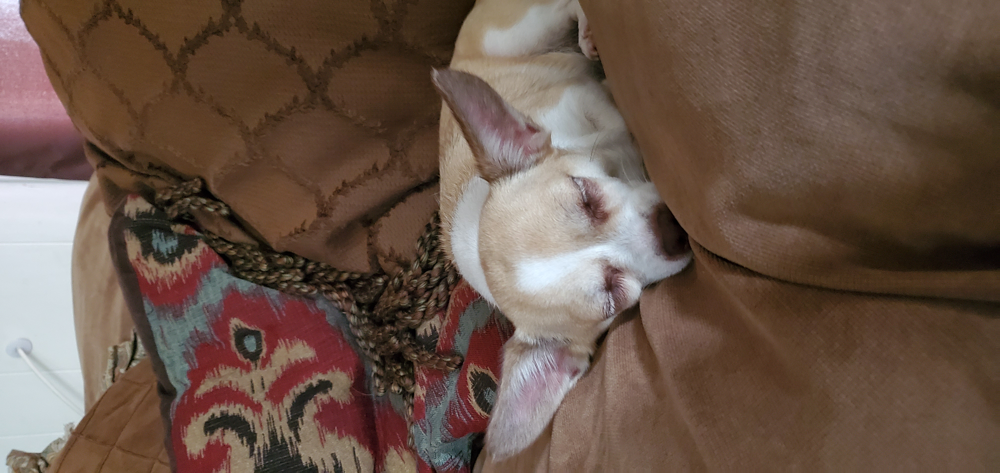

# CSE 110: Software Engineering

## **Who am I?**
 My name is Cristian Antonio Hernandez, a second year transfer student and Math - CS major at _UCSD_  My interests are in applied mathematics, in particular, optimization, and computer science. What inspired me to start programming was my interest in video games, I wanted to undstand how a game was what makes a character move, act, etc, but more importantly, what made the game so ~~addicting~~ fun.

 > ***The code doesn't work...WHY?*** - Most programmers 

Use syntax when programming in languages that require it. 

e.g. Java:  `System.out.println("Hello World!");`

An example of a program in C++:
```
#include <iostream>

using namespace;
int main()
{
    cout << "Hello World!" << endl;   
    return 0; 
}
```
[Lab Week 0 & 1 - VSCode, Markdown, and Git Part 1](https://canvas.ucsd.edu/courses/39754/assignments/526068)

This is my dog Princess, a chihuahua mix. 


Clicking [this link](#who-am-i) takes you back to _Who am I_ section.

### Programming Knowledge
Languages:
* C++
* Java
* C#
* C
* Python

### Courses for this quarter.
Fall 2022
1. CSE 110
2. ECE 174
3. MATH 173A
4. MATH 187A

### Lab 0 - 1 Checklist
- [x] Installing Visual Studio Code and Extensions
- [x] (Re)Familiarizing Ourselves with Git
- [ ] [Using Markdown](https://docs.github.com/en/get-started/writing-on-github/getting-started-with-writing-and-formatting-on-github/basic-writing-and-formatting-syntax#task-lists)